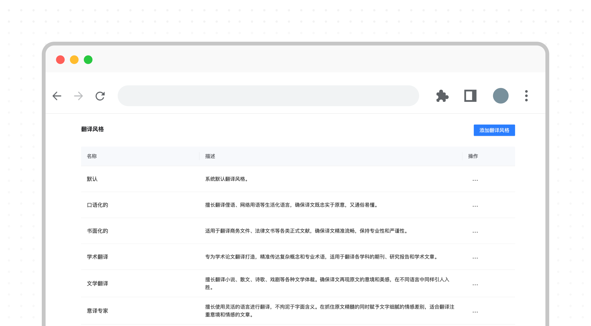
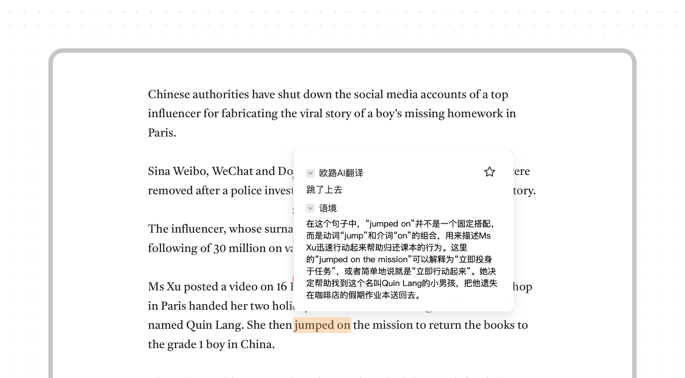
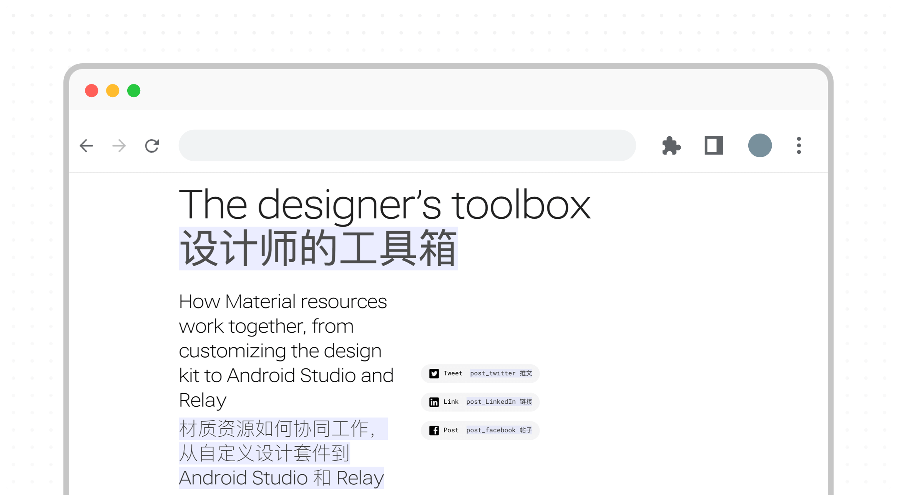
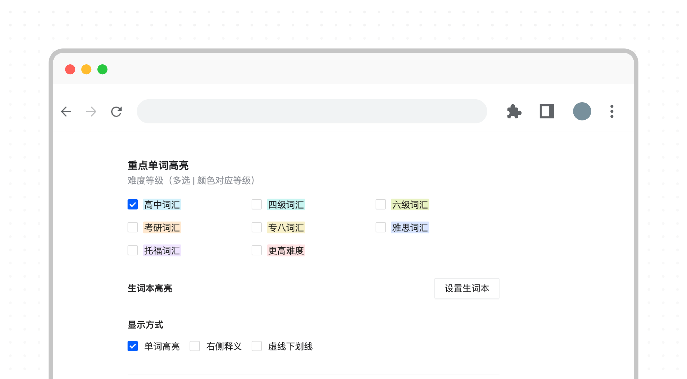
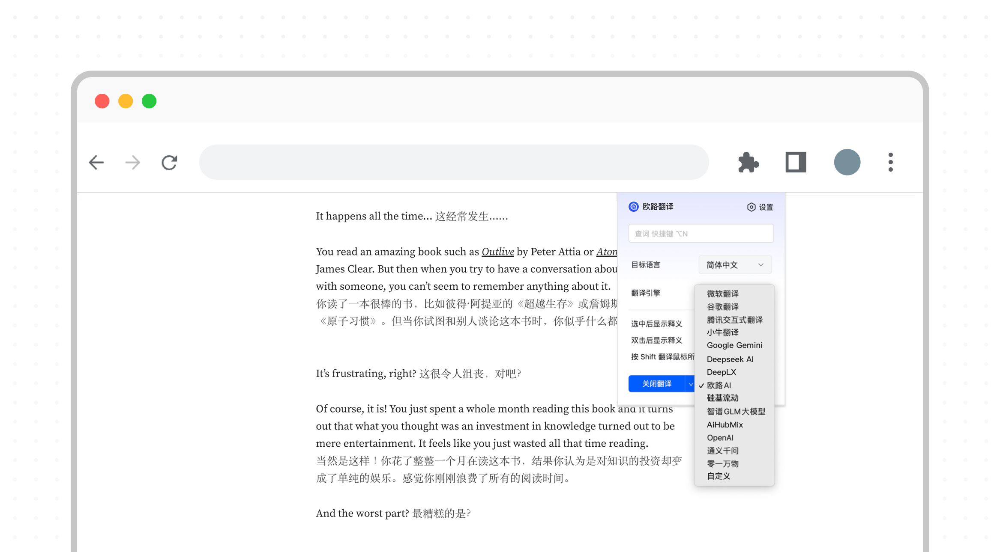
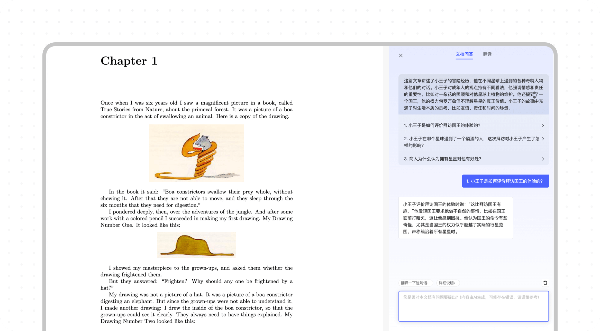
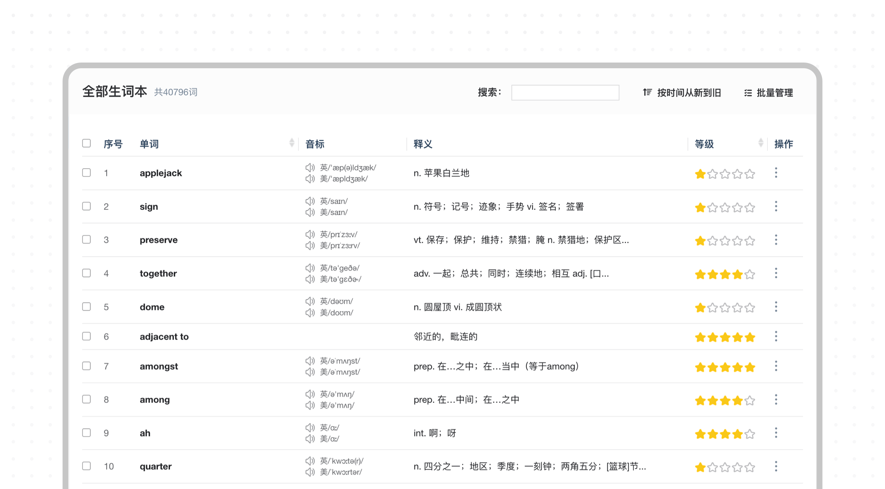

# 关于当前仓库
本仓库主要用于发布欧路翻译扩展插件的[Release](https://github.com/xianwenzi888/test-fanyi/releases)的版本以及使用[Github Issues](https://github.com/xianwenzi888/test-fanyi/issues)收集和跟进用户反馈。 
### 🌟 欧路翻译插件 - 强大而实用的翻译工具 🚀

**欧路翻译插件**是一款高效、智能的浏览器插件，专为提升阅读和翻译体验而设计。不论是学习外语、阅读外文文献，还是处理工作任务，这款插件都能帮您轻松应对语言障碍。以下是它的主要功能及亮点介绍！ 🎉

---

## 🌟 欧路翻译插件功能详解 🚀  
欧路词典是一款功能强大且高度定制化的翻译与学习工具，它不仅能满足日常翻译需求，还能在学术、工作等多场景下助您一臂之力！下面就让我们用图文并茂的方式，来详细了解欧路词典的亮点功能吧！💡

---

## 🎯 功能亮点

### 1. **一键划词查看释义 🖱️**
选择或双击单词，欧路词典即可快速划词翻译！再也不用复制粘贴，省时省力，一步到位！😎

---

### 2. **精选翻译风格库 🎨**
✨ 汇集十余种翻译风格，满足不同场景需求！  
✨ 自定义翻译风格，打造只属于你的专属翻译！

---

### 3. **划词搜索支持语境 🌐**
划词不仅限于单词，欧路词典更能理解上下文语境，为你提供贴近实际的翻译结果！是不是很贴心？🤗

---

### 4. **一键网页翻译 🌍**
浏览外文网站也不用担心啦！  
✔️ 支持全文翻译  
✔️ 双语逐段对照，原文译文一目了然！💻

---

### 5. **高亮单词等级 🖍️**
学习生词神器来了！🎉  
勾选不同的单词等级，词典会在原文中将这些单词高亮显示，轻松记住重点词汇！💪

---

### 6. **多种翻译引擎选择 🤖**
想尝试多种翻译风格？没问题！💡  
支持微软、谷歌等引擎，还集成了：  
- 欧路 AI 🧠  
- OpenAI GPT 🌟  
- DeepSeek 等超强语言模型！  

翻译更加精准、流畅，满足各种需求！✨

---

### 7. **文档归纳与提问功能 📄**
🌟 一键归纳文档主旨，快速掌握文章内容！  
🌟 支持针对文章内容提问，无痛阅读论文，科研党福音！📚

---

### 8. **学习数据同步 🔄**
无缝同步生词本与背单词功能！🌈  
不管是手机、平板还是电脑端，学习数据永远在线，学习效率更高效！📊

---

### 9. **视频字幕翻译 🎥**
追剧、学习两不误！欧路词典支持主流视频网站字幕翻译，轻松掌握各类外语资讯！  
无论是 YouTube 还是 B站，语言障碍？不存在的！💬

---

## 🎉 应用场景

- **学术研究**：快速理解论文主旨，节省宝贵时间 ⏳  
- **外语学习**：掌握词汇和语境，助你高效提升外语水平 📖  
- **跨境电商**：精准翻译，助力全球化商业沟通 💼  
- **日常生活**：轻松应对外语网页及视频内容翻译 🏡  

---

### 🎉 如何使用？

- 前往 [欧路翻译插件页面](https://www.eudic.net/v4/en/app/plugins)，下载安装适合您的浏览器版本。  
- 安装完成后，开启浏览器，体验划词搜索和翻译的便利功能！  

---

💡 **Tip**: 欧路翻译插件结合智能技术与简洁设计，助您高效应对外语挑战！快来试试吧~ 😊

